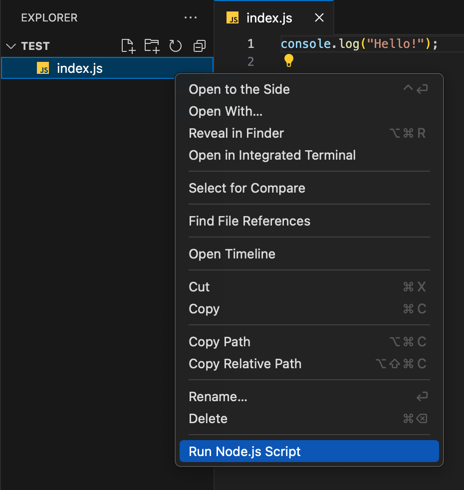

# Changelog

## [1.0.4] - 2024-08-10
### Added
- **Context Menu Integration**: You can now right-click on a `.js` file in the Explorer and select "Run Node.js Script" to run the file directly in the terminal.
- The "Run Node.js Script" option is now located at the bottom of the context menu.

### Changed
- The extension now positions the "Run Node.js Script" command at the bottom of the context menu in a custom group.

## [1.0.2] - 2024-07-31
### Added
- Updated logo.png.
- Terminal reuse: Reuses the same terminal if it exists.
- Terminal name changed to 'node'.
- Terminal close event listener for proper resource management.

### Changed
- Updated the logic to use file path for terminal command.

## [1.0.1] - 2024-07-31
### Added
- File name extraction for better understanding and readability in terminal output.
- Now the terminal command writes `node index.js` instead of the full file path `node`.

### Changed
- Updated terminal title in the `activate` function for better clarity.

### Thanks
- Special thanks to [Biplab Roy](https://github.com/biplabroy-1) for his valuable contributions, including:
  - Importing the `path` module and using it to get the file name from the file path.
  - Updating the terminal title in the `activate` function.
