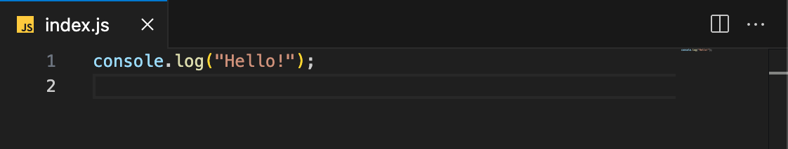
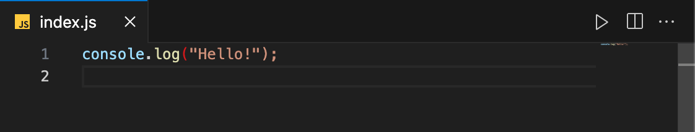

# VSCode Node.js Runner

A VS Code extension to run Node.js scripts with just one button.

## Features
- **One-Click Execution**: Easily run your Node.js scripts directly from VS Code.
- **Context Menu Integration**: Right-click on a `.js` file and select "Run Node.js Script."

### Before Installing the Extension

Here’s how your context menu looks before you install the Node.js Runner extension:

### After Installing the Extension

After installing the Node.js Runner extension, the "Run Node.js Script" option is added to your context menu:

## Installation

1. Open VS Code.
2. Go to the Extensions view by clicking the Extensions icon in the Activity Bar on the side of the window or by pressing `Ctrl+Shift+X` or `Cmd+Shift+X`.
3. Search for "Node.js Runner" and click Install.

Alternatively, you can install it from the [Visual Studio Code Marketplace](https://marketplace.visualstudio.com/items?itemName=IvanShcherbakov.vscode-nodejs-runner&ssr=false#qna).

## Usage

1. Open a JavaScript or TypeScript file.
2. Click the `Run Node.js Script` button (play icon) in the editor title.
3. The script will run in a new terminal.

## Configuration

There are no specific configurations for this extension.

## Development

To contribute to this project:

1. Clone the repository: `git clone https://github.com/heroivaan/vscode-nodejs-runner.git`
2. Install dependencies: `npm install`
3. Make your changes and open a pull request.

## License

This project is licensed under the MIT License. See the [LICENSE](LICENSE) file for details.
